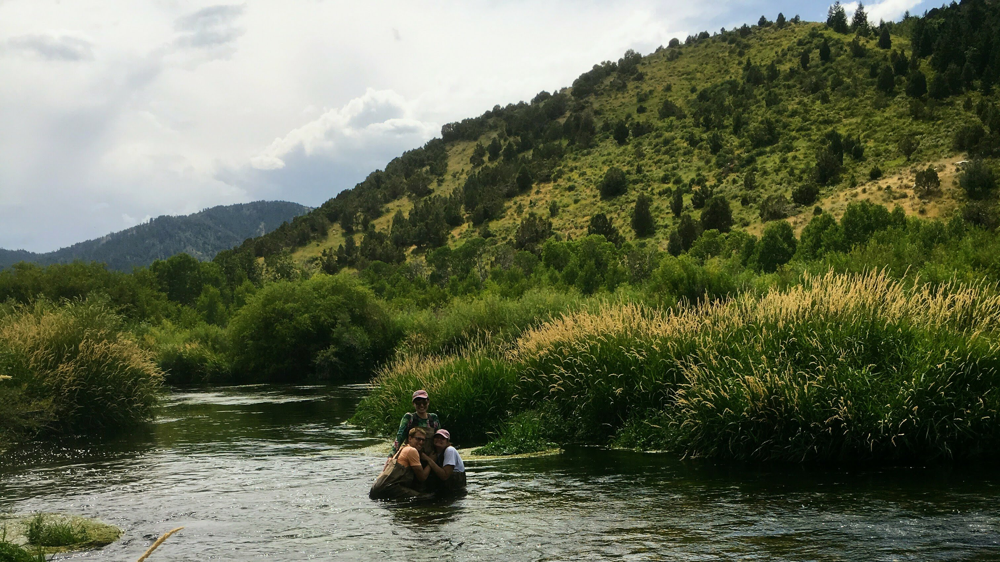

## About Me

Hi, I'm Michelle! I'm an aquatic ecosystem ecologist. I work to better understand nutrient (nitrogen, carbon) cycling in freshwater ecosystems using environmental sensors and mathematical modeling. My research sits at the intersection of traditional biogeochemistry approaches and data science-driven analytical techniques. 

Currently, I am a PhD student working with Dr. Amy Marcarelli at Michigan Technological University. I earned my Master's in Ecology and Evolutionary Biology in 2019 at the University of Kansas, where I worked with Dr. Amy Burgin to discover how a large-scale nutrient and microbial community addition affected the chemistry and biology of the Kansas River. I recieved my BS in Environmental Engineering at Michigan Technological University in 2017.

In my spare time, I enjoy hiking, camping, and baking. I also take care of a very fluffy cat named Charlie.

