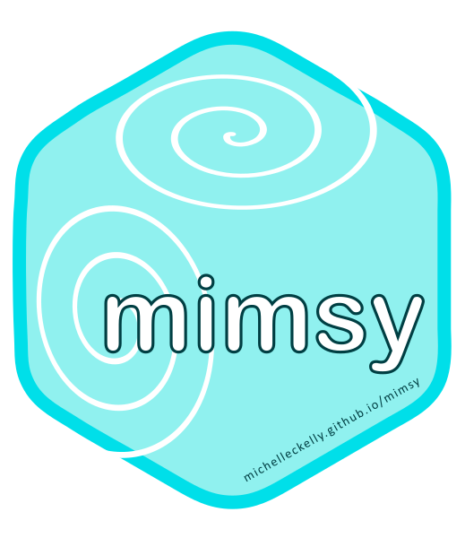

## Open-source Projects  

 **[The `mimsy` R package](https://michelleckelly.github.io/mimsy/)**  
_Development: 2018 - present._  
"Calculate MIMS dissolved gas concentrations without getting a headache."  
`mimsy` is a data analysis package that transforms raw MIMS (Membrane Inlet Mass Spectrometer) signal data into dissolved gas concentration readings using standard solubility equations. `mimsy` is designed to be simple and accessible for non-R users. Click on the link above to check out the `mimsy` website and learn more.

**[The metabolic regime concept: A practical proof](https://github.com/michelleckelly/Kelly_dcei/blob/master/FinalProject/FinalProject.pdf)**  
_Development: Summer 2018._  
A fully reproducable, open-source mini-analysis of the metabolic regimes concept (Bernhardt et al. 2018). 
