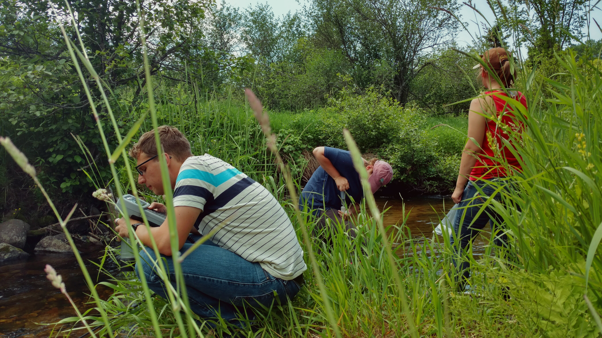

## Research
**High supply, high demand: A unique nutrient addition decouples nitrate uptake and metabolism in a large river.**  
_Masters Thesis (Awarded with Honors), Department of Ecology and Evolutionary Biology, University of Kansas._  
_Mentor: Dr. Amy J. Burgin, funded by NSF DEB-Ecosystems RAPID #1822960 to Dr. Lydia H. Zeglin and Dr. Amy J. Burgin._

_Check out the defense presentation on YouTube:_ 
<a href="https://www.youtube.com/watch?v=LmXlKZDj8hE" target="_blank">

**Exploring within-reach variation in nitrogen cycling processes.**  
_NSF REU, Michigan Technological University. In collaboration with A. Marcarelli and K. Nevorski._  

Do small-scale bottle assays reflect reach-scale nitrogen cycling dynamics? We explored the variation in bottle assay estimates of nitrification and denitrification along an upstream to downstream sampling gradient. Furthermore, we contrasted the differences in variation between sites with relatively low, moderate, or high discharge.

## First-author Conference Presentations

**Kelly, M.**, Zeglin, L., Burgin, A. (2019, May). High supply, high demand: a unique nutrient addition decouples nitrate uptake and metabolism in a large river. Original talk at the Society for Freshwater Science annual meeting, Salt Lake City, UT. National conference.

**Kelly, M.**, Burgin, A. (2018, October). Where does it all go? Understanding nitrogen cycling and metabolism in response to a sustained pulse event in the Kansas River. Original talk at the Great Plains Limnology Conference, Lawrence, KS. Regional conference.

**Kelly, M.**, Burgin, A. (2018, May). Nitrogen cycling, river metabolism, and winter: impact of nitrogenous waste pulse releases on the Kansas River. Original talk at the Society for Freshwater Science annual meeting, Detroit, MI. National conference.

**Kelly, M.**, Marcarelli, A., Nevorski, K. (2017, June). Within-reach variation in nitrification and denitrification rates in streams of the Upper Peninsula of Michigan. Poster presentation at the Society for Freshwater Science annual meeting, Raleigh, NC. National conference.

**Kelly, M.**, Marcarelli, A., Nevorski, K. (2017, April). Within-reach variation in nitrification and denitrification rates in streams of the Upper Peninsula of Michigan. Poster presentation at the Ecosystem Science Center Student Research Forum, Houghton, MI. Regional conference. **Awarded Best Undergraduate Poster.**
